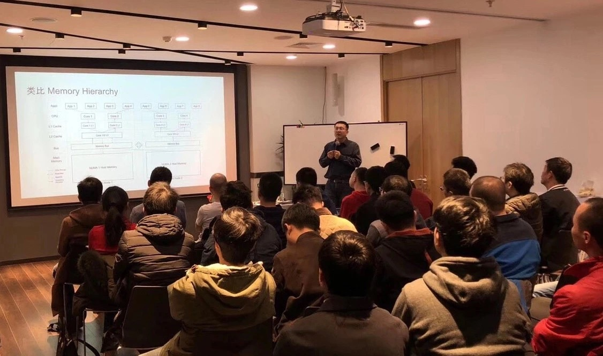

在第 90 期 Infra Meetup 上，来自知乎的孙晓光老师为大家分享了知乎已读服务的架构演进的经验。小伙伴们热情爆棚，QA 环节长达 1 小时，快戳视频看看孙老师都分享了哪些有趣的「踩坑经验」吧！

>讲师介绍：孙晓光，知乎搜索工程团队负责人，TiKV Committer。

- [视频 | Infra Meetup No.90：知乎已读服务架构演进](https://www.bilibili.com/video/av46345500)

- [PPT 链接](https://eyun.baidu.com/s/3qZWt6MC)

孙晓光老师在本期 Meetup 上提到，知乎已读服务的设计严格意义上来说同很多业务向系统的设计有不少差异，而这些差异反映在过程和结果上有些是正向的，也有些是负向的。但是很高兴的看到至少在上线一年多来，整体的收益是远高于所付出的代价的。

最后他希望在近期全量数据迁移到 TiDB 完成后能够进一步解决目前架构的一些尚存的痛点问题，让这个架构跑的更稳跑的更好。

>PingCAP Infra Meetup 
>
>作为一个基础架构领域的前沿技术公司，PingCAP 希望能为国内真正关注技术本身的 Hackers 打造一个自由分享的平台。自 2016 年 3 月 5 日开始，我们定期在周末举办 Infra Meetup，与大家深度探讨基础架构领域的前瞻性技术思考与经验，目前已在北京、上海、广州、成都、杭州等地举办。在这里，我们希望提供一个高水准的前沿技术讨论空间，让大家真正感受到自由的开源精神魅力。
