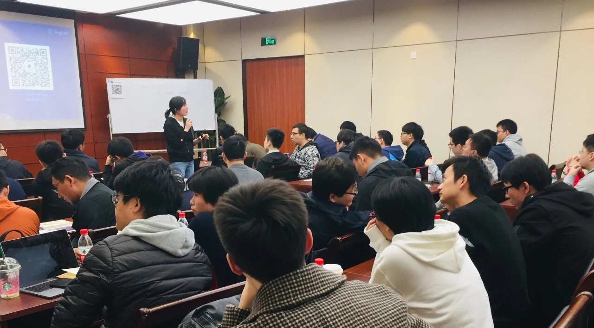

在上周六举办的 Infra Meetup No.91 上，我司 TiKV 研发工程师吴雪莲老师为杭州小伙伴分享了分布式事务在 TiDB 中实现的原理和细节，以下是视频 & 文字回顾，enjoy！

>讲师介绍：吴雪莲，TiKV 研发工程师，目前主要负责 TiDB/TiKV 事务、TiKV 计算层 Coprocessor 相关研发。

- [视频 | Infra Meetup No.91：Head First Distributed Transaction in TiDB](https://www.bilibili.com/video/av46985168)

- [PPT 链接](https://eyun.baidu.com/s/3nw2EgSp)

本次分享的主题是分布式事务在 TiDB 中的实现，主要围绕以下三个方面展开：

1. 分布式事务的定义

2. Percolator 中事务的实现

3. TiDB 中事务的实现及注意事项

首先，在分布式事务的定义中，主要介绍了 ACID 和四种常见隔离级别。然后解读了 Percolator 中事务实现，核心内容包括：1. 基于快照隔离级别的优缺点；2. 如何通过两阶段提交实现跨行跨表的分布式事务。

最后，我们详细介绍了 TiDB 中分布式事务的实现，包括 TiDB 如何将关系型数据转化成 key-value 存储，TiDB 中两阶段提交的实现细节及异常处理，以及 TiDB 事务使用过程中的注意事项。

>PingCAP Infra Meetup 
>
>作为一个基础架构领域的前沿技术公司，PingCAP 希望能为国内真正关注技术本身的 Hackers 打造一个自由分享的平台。自 2016 年 3 月 5 日开始，我们定期在周末举办 Infra Meetup，与大家深度探讨基础架构领域的前瞻性技术思考与经验，目前已在北京、上海、广州、成都、杭州等地举办。在这里，我们希望提供一个高水准的前沿技术讨论空间，让大家真正感受到自由的开源精神魅力。
