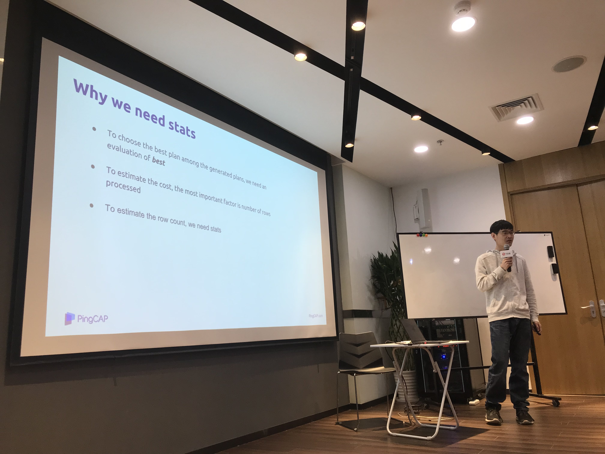

在上周六北京举办的 Infra Meetup No.92 上，我司 TiDB 开发工程师谢海滨老师为大家介绍了 TiDB 中统计信息的原理及细节。以下是视频 & 文字回顾，enjoy！

>讲师介绍：谢海滨，TiDB 研发工程师，目前主要负责统计信息以及优化器相关工作。

- [视频 | Infra Meetup No.92：Introduction to TiDB Statistics](https://www.bilibili.com/video/av47571391)

- [PPT 链接](https://eyun.baidu.com/s/3huh0sCW)

本次分享首先介绍了统计信息的作用以及 TiDB 统计信息的基本组成部分，接下来围绕着统计信息的估算、收集以及更新 3 个部分具体展开：

- 在估算方面，介绍了直方图和 Count-Min Sketch 的适用场景以及估算方法，以及 TiDB 是如何利用索引的统计信息来减少多列估算时的独立性假设。

- 在收集方面，介绍了 analyze 语句的具体流程以及相关参数，以及 auto analyze 的触发条件。

- 在更新方面，介绍了 TiDB 是如何更新 row count 和 modify count，以及是如何利用查询结果更新直方图和 Count-Min Sketch 的。

>PingCAP Infra Meetup 
>
>作为一个基础架构领域的前沿技术公司，PingCAP 希望能为国内真正关注技术本身的 Hackers 打造一个自由分享的平台。自 2016 年 3 月 5 日开始，我们定期在周末举办 Infra Meetup，与大家深度探讨基础架构领域的前瞻性技术思考与经验，目前已在北京、上海、广州、成都、杭州等地举办。在这里，我们希望提供一个高水准的前沿技术讨论空间，让大家真正感受到自由的开源精神魅力。

