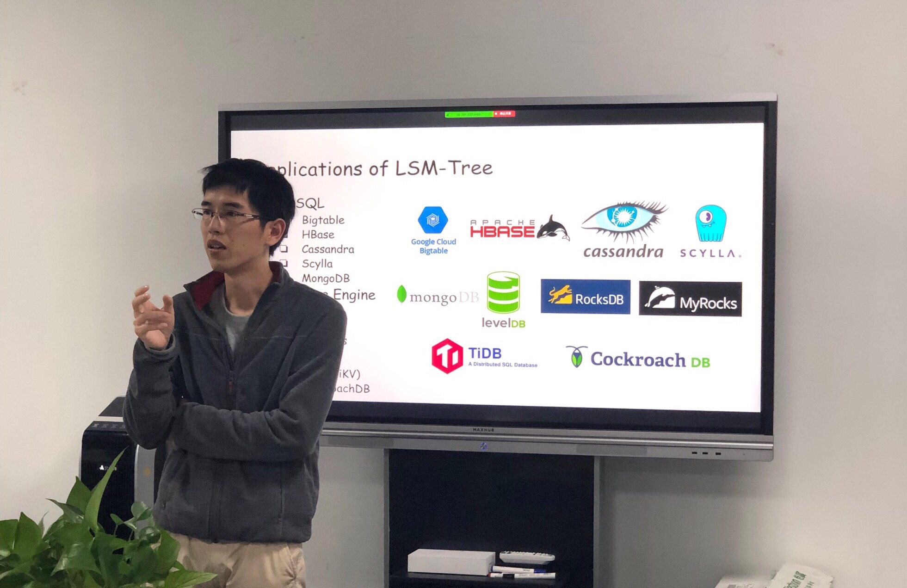

在上周六广州举办的 Infra Meetup No.93 上，来自微信的林金河老师为大家分享了 LSM-Tree 相关知识。以下为视频&文字回顾，enjoy~

>讲师介绍：林金河，目前在微信从事分布式存储相关的工作

- [视频 | Infra Meetup No.93：A Study of LSM-Tree](https://v.qq.com/x/page/o0854y7073o.html)

- [PPT 链接](https://eyun.baidu.com/s/3i6HFMEp)

本次分享的主要内容包括：

1. LSM-Tree 的基本原理，包括 LSM-Tree 的文件组织结构、Point Query、Range Query 和 Compaction。

2. LSM-Tree 存在的问题和相关的优化方法。主要有两方面：
  - 读放大。目前的优化思路是通过 filter 来减少不必要的 I/O，比如 bloom filter、SuRF。
  - Compaction 造成的负载抖动和写放大。一方面，可以通过软硬件结合的方式，将 compaction 的任务交给专门的 coprocessor 来做，将 compaction 带来的负面影响尽可能隔离开。另一方面，就是从数据结构和算法上，尽可能减少写放大，比如 PebbleDB 和 WiscKey。

3. 最后简单总结了一下：LSM-Tree 的优化，基本都是在读放大、写放大和空间放大这三者间做 trade-off。理论上没法同时让这三者达到最优（有点像分布式系统的 CAP 定理）。

>PingCAP Infra Meetup 
>
>作为一个基础架构领域的前沿技术公司，PingCAP 希望能为国内真正关注技术本身的 Hackers 打造一个自由分享的平台。自 2016 年 3 月 5 日开始，我们定期在周末举办 Infra Meetup，与大家深度探讨基础架构领域的前瞻性技术思考与经验，目前已在北京、上海、广州、成都、杭州等地举办。在这里，我们希望提供一个高水准的前沿技术讨论空间，让大家真正感受到自由的开源精神魅力。