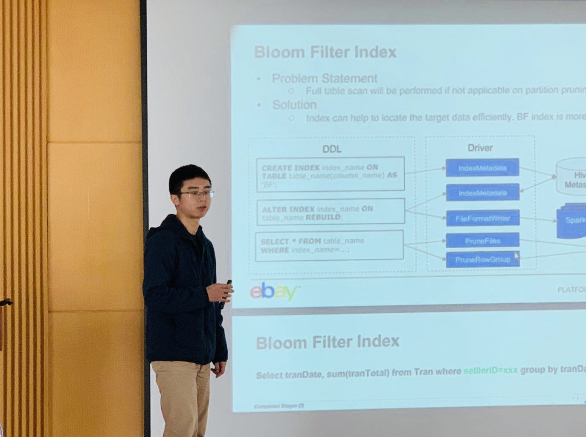

## Topic 1：TiDB 与 TiFlash 扩展 - 向真 HTAP 平台前进

>讲师介绍：孙若曦，PingCAP 核心开发工程师，负责 OLAP 相关产品设计和开发。曾在星环科技、NVIDIA 就职担任 Tech Lead。主要研究分布式系统、数据库等领域。

+ [视频 | Infra Meetup No.94：TiDB 与 TiFlash 扩展 - 向真 HTAP 平台前进](https://www.bilibili.com/video/av48183431/?p=1)
+ [PPT 链接](https://eyun.baidu.com/s/3ggpuk19)

本次分享的内容主要包括以下三个方面：

1. HTAP 的核心价值：能够解决当前各类数据平台上广泛存在的工具链过于复杂，运维成本高，数据实效性和一致性等问题。

2. HTAP 面临的技术挑战：OLTP 场景通常使用行存，而 OLAP 场景通常使用列存；另外，OLAP 任务因为对系统资源占用较多，也会严重影响 OLTP 业务。

3. TiFlash 是如何解决这些问题的：
    * 使用列存及向量化计算来满足 OLAP 业务；
    * 数据使用 Raft Learner 机制同步到列存；
    * 拥有与 TiDB 相同的 Scalability；
    * OLTP 与 OLAP 的物理资源完全隔离，避免互相干扰；
    * TiDB/TiSpark 能够同时访问行存和列存副本，通过 CBO 选取最优化的访问方式；
    * 为 TiFlash 引入 MPP 能力。

## Topic 2：eBay 在 Spark SQL 的性能优化

>讲师介绍：王刚，eBay 大数据工程师。2017 年硕士毕业于南京大学，后一直在 eBay 从事大数据研发工作。

+ [视频 | Infra Meetup No.94：eBay 在 Spark SQL 的性能优化](https://www.bilibili.com/video/av48183431/?p=2)
+ [PPT 链接](https://eyun.baidu.com/s/3ggpuk19)

本次 Topic 主要分享了 eBay 在 Spark SQL 上所做的一系列探索与优化工作。其中包括我们在 index 上所尝试 Bloom filter index，还有我们为了解决大表与大表 join 所做的一些方案，bucket join 和 range partition。MV 是我们在 Cache 上做的探索。新的 CBO 弥补了部分现有 Spark CBO 的缺陷，提供了更强大的 cost based optimize 的能力。

>PingCAP Infra Meetup
>
>作为一个基础架构领域的前沿技术公司，PingCAP 希望能为国内真正关注技术本身的 Hackers 打造一个自由分享的平台。自 2016 年 3 月 5 日开始，我们定期在周末举办 Infra Meetup，与大家深度探讨基础架构领域的前瞻性技术思考与经验，目前已在北京、上海、广州、成都、杭州等地举办。在这里，我们希望提供一个高水准的前沿技术讨论空间，让大家真正感受到自由的开源精神魅力。