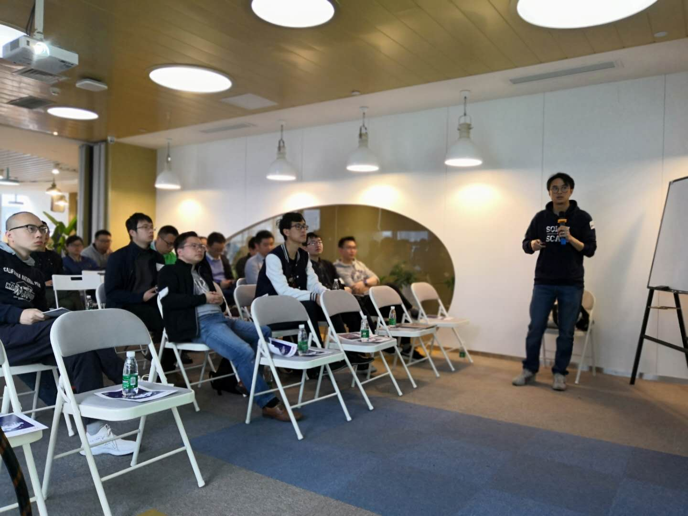

在上周举办的成都 · Infra Meetup No.95 上，我司 TiDB SQL Engine 开发工程师姚珂男为大家介绍 TiDB SQL 层的技术原理，以下是视频&文字回顾，enjoy～

>讲师介绍：姚珂男，TiDB SQL Engine 开发工程师，主要工作为优化器及相关模块的维护和新功能开发，致力于提升查询计划的正确性和稳定性。

+ [视频 | Infra Meetup No.95：Introduction of TiDB SQL Layer](https://www.bilibili.com/video/av48246570)
+ [PPT 链接](https://eyun.baidu.com/s/3i5ZbdWh)

本次分享主要介绍 TiDB SQL 层的三个组件：优化器，统计信息和执行引擎。

+ 优化器部分主要举例介绍了逻辑优化规则和物理优化框架；
+ 统计信息部分主要介绍直方图，CMSketch 以及使用方法；
+ 执行引擎部分以两种 join 方式为例介绍了我们在执行引擎实现中用到的一些优化方法。

>PingCAP Infra Meetup
>
>作为一个基础架构领域的前沿技术公司，PingCAP 希望能为国内真正关注技术本身的 Hackers 打造一个自由分享的平台。自 2016 年 3 月 5 日开始，我们定期在周末举办 Infra Meetup，与大家深度探讨基础架构领域的前瞻性技术思考与经验，目前已在北京、上海、广州、成都、杭州等地举办。在这里，我们希望提供一个高水准的前沿技术讨论空间，让大家真正感受到自由的开源精神魅力。
