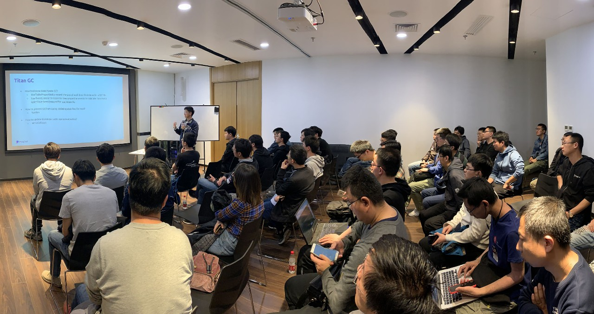

在上周六举办的 Infra Meetup No.96 上，我司 TiKV 研发工程师张博康为大家介绍了我们自研的高性能单机 key-value 存储引擎 Titan，以下是视频 & 文字回顾，enjoy～

> 讲师介绍：张博康，TiKV 研发工程师，目前负责 TiKV raftstore 以及存储引擎相关工作。

+ [视频 | Infra Meetup No.96：Introduction to Titan](https://www.bilibili.com/video/av49579570/)
+ [PPT 链接](https://eyun.baidu.com/s/3gfSuGz5)

本次分享的主要内容包括：

+ 分析 LSM-Tree 的写放大问题，以阐述 Titan 核心的思路——key-value 分离。

+ 从设计目标出发，介绍并对比了 Wisckey 和 Titan 的结构差异。

+ 介绍了 Titan 的具体设计与实现，包括如何通过 RocksDB 的 TableBuilder，TableProperties，EventListener，WriteCallback 等现有机制实现 key-value 的分离以及 Titan 的 GC 流程。

+ 展示了 Titan 与 RocksDB 在大 value 情况下的性能对比。

*延展阅读*：

- [Titan 的设计与实现](https://www.pingcap.com/blog-cn/titan-design-and-implementation/)

- [The Way to TiDB 3.0 and Beyond](https://mp.weixin.qq.com/s/dJTVjeAdTaJGh2Uzouzh0g)

- [WiscKey 论文](https://www.usenix.org/system/files/conference/fast16/fast16-papers-lu.pdf)

>PingCAP Infra Meetup
>
>作为一个基础架构领域的前沿技术公司，PingCAP 希望能为国内真正关注技术本身的 Hackers 打造一个自由分享的平台。自 2016 年 3 月 5 日开始，我们定期在周末举办 Infra Meetup，与大家深度探讨基础架构领域的前瞻性技术思考与经验，目前已在北京、上海、广州、成都、杭州等地举办。在这里，我们希望提供一个高水准的前沿技术讨论空间，让大家真正感受到自由的开源精神魅力。

