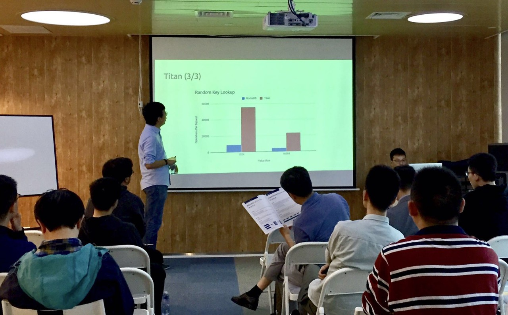
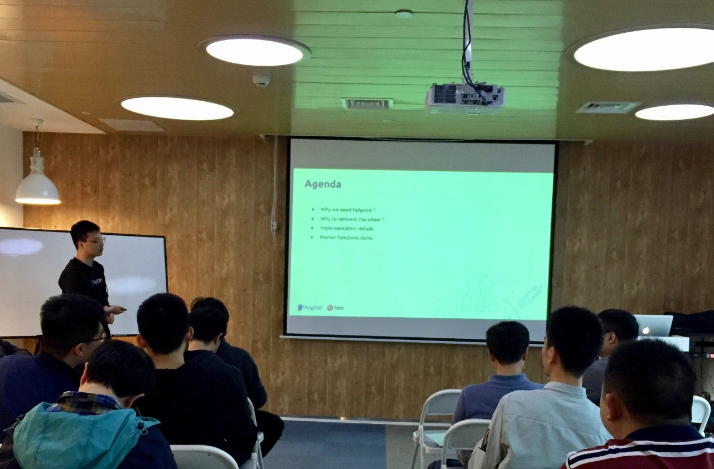

## Topic 1：What's New in TiDB 3.0 

> 讲师介绍：申砾，PingCAP 技术 VP。

+ [视频 | Infra Meetup No.97：What's New in TiDB 3.0](https://www.bilibili.com/video/av50331748/?p=1)
+ [PPT 链接](https://eyun.baidu.com/s/3c3LWmPU)

1 月 19 日，TiDB 发布 3.0 Beta 版，相比 2.1 版本，该版本对系统稳定性、优化器、统计信息以及执行引擎做了很多改进。申砾老师为大家分享了 TiDB 3.0 的新特性及未来的规划。

## Topic 2：An Introduction to Failpoint Design

> 讲师介绍：龙恒，TiDB SQL Infra Team 开发工程师，主要工作是 TiDB-Lightning / TiKV-Importer 的维护和新功能开发，致力于性能和稳定性提升。

+ [视频 | Infra Meetup No.97：An Introduction to Failpoint Design](https://www.bilibili.com/video/av50331748/?p=2)
+ [PPT 链接](https://eyun.baidu.com/s/3c3LWmPU)

本次分享龙恒老师首先介绍了 Failpoint 的使用场景，以及 github.com/etcdi-io/gofail 的优缺点，然后对 Failpoint 设计原则、实现细节及实现过程中的取舍作了介绍，最后演示了各种 Marker 函数的用法，以及在并行测试中如何使用 context 控制 failpoints Enable/Disable，从而达到隔离不同并行任务的目的。

