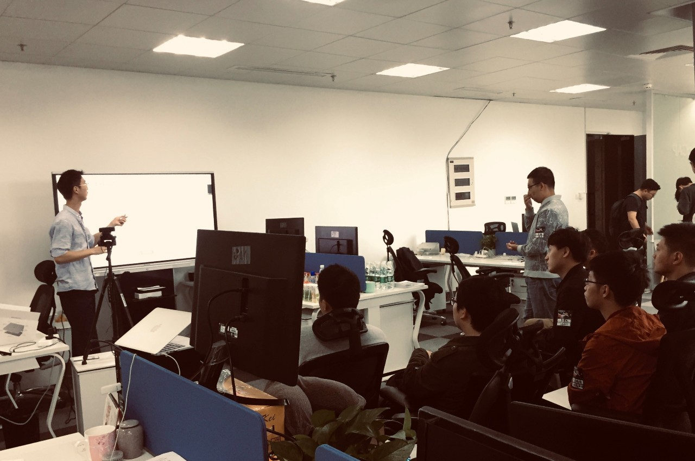

> 讲师介绍：徐怀宇，TiDB 研发工程师，目前主要负责查询执行引擎相关工作。

+ [视频 | Infra Meetup No.98：Compiled and Vectorized Queries](https://www.bilibili.com/video/av50329586)
+ [PPT 链接](https://eyun.baidu.com/s/3nxc8ESh)

本次分享徐怀宇老师为大家介绍了论文《Everything You Always Wanted to Know About Compiled and Vectorized Queries But Were Afraid to Ask》，主要包括：

- 介绍经典 Volcano 模型的执行流程，并分析其运行时性能。

- 介绍行存、列存的基本概念，并进而引出向量化执行，分析其如何克服经典 Volcano 模型的缺点。

- 介绍代码生成的基本概念，结合案例分析其如何克服经典 Volcano 模型的缺点。

最后，结合论文内容，重点从 micro-architecture, data-parallel execution 两个方面，分析对比向量化执行和代码生成的特性，进而引出论文结论：向量化执行在 memory-bound 类的查询中更有优势，代码生成在 calculation-heavy 类的查询中更有优势。但是总体来看，在 OLAP 场景中，向量化执行和代码生成的执行性能相近。

*延伸阅读* ：

- [论文链接](http://www.vldb.org/pvldb/vol11/p2209-kersten.pdf)

>PingCAP Infra Meetup
>
>作为一个基础架构领域的前沿技术公司，PingCAP 希望能为国内真正关注技术本身的 Hackers 打造一个自由分享的平台。自 2016 年 3 月 5 日开始，我们定期在周末举办 Infra Meetup，与大家深度探讨基础架构领域的前瞻性技术思考与经验，目前已在北京、上海、广州、成都、杭州等地举办。在这里，我们希望提供一个高水准的前沿技术讨论空间，让大家真正感受到自由的开源精神魅力。
