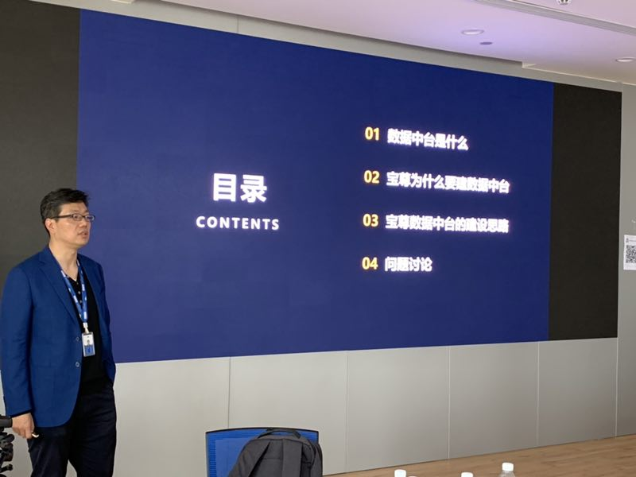
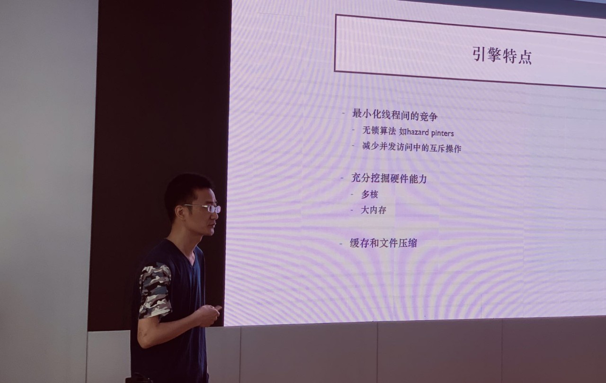
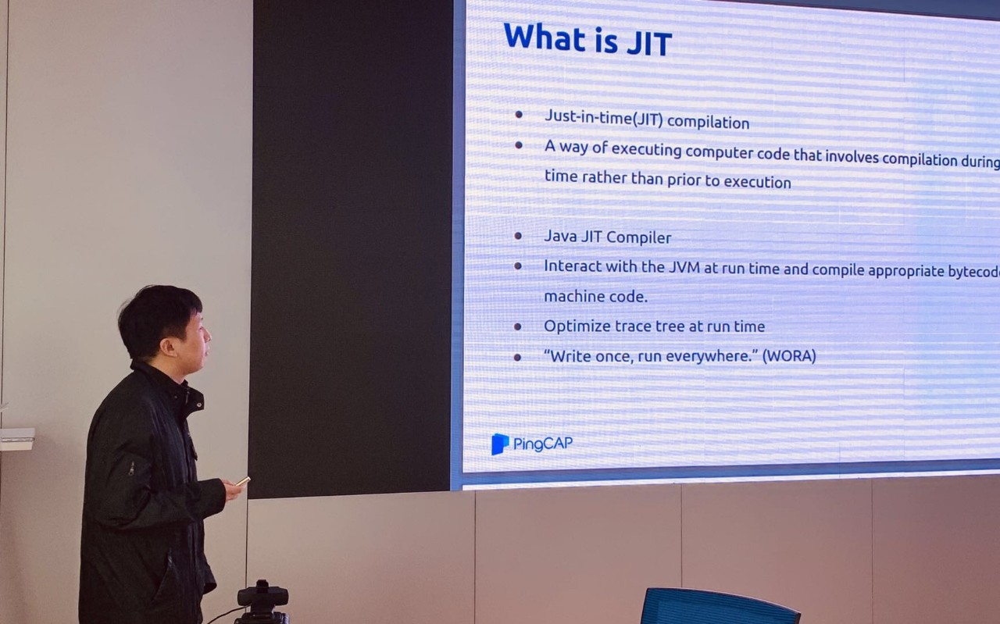

## Topic 1: 宝尊对数据中台搭建的思考与探索

>讲师介绍：张建，宝尊电商技术总监。

数据中台最近特别火，很多企业都在关注如何构建自己的数据中台，利用数据中台打造数据驱动的经营能力。同时，数据中台的概念也漫天飞，但是很难有一个大家都认同的标准。一个有趣的现象是数据中台在国内数据圈子里在升温，但是国外却鲜有提及，以至于我们在向 Gartner 咨询相关主题的时候，国外的咨询师都一头雾水，不知道数据中台是什么。甚至想找一个对“数据中台”比较恰当的英文翻译都很难。

面对这个既新又杂的概念，宝尊也在进行自己的“数据中台”探索。本次研讨会，宝尊的算法和大数据部负责人张建就自己对数据中台的调研和思考，与大家一起开脑洞，共同研究和探讨了数据中台是什么，它和数据仓库有什么区别，数据中台的核心价值是什么等主题。

>应讲师要求，该分享视频&PPT 资料仅限内部学习交流，不对外公开～

## Topic 2：WiredTiger 引擎实现原理

> 讲师介绍：许鹏，携程机票技术总监，负责机票大数据基础平台的架构和运维，《Apache Spark 源码剖析》一书作者，三年 Presto 及 Elasticsearch，MongoDB 集群的一线运维经验。长期专注于分布式计算引擎技术和分布式存储的设计与实现。

+ [视频 | Infra Meetup No.99：WiredTiger 引擎实现原理](https://www.bilibili.com/video/av50340141/?p=1)
+ [PPT 链接](https://eyun.baidu.com/s/3ghaJfxT)

WiredTiger 作为 MongoDB 的默认存储引擎，许鹏从整体架构，内存管理，磁盘寻址，数据持久化，文件压缩最佳实践等维度介绍 WiredTiger，并描述如何最小化线程间的竞争，如何充分现代计算机平台中的多核和大内存的优势，在 WiredTiger 并发控制机制中的体现，最后也介绍从源码级别怎么分析和调试 WiredTiger。

## Topic 3：JIT in Databases

> 讲师介绍：吴逸飞，TiSpark 研发工程师。

+ [视频 | Infra Meetup No.99：WiredTiger 引擎实现原理](https://www.bilibili.com/video/av50340141/?p=2)
+ [PPT 链接](https://eyun.baidu.com/s/3ghaJfxT)

本次分享内容主要包括：

1. 介绍了 JIT (即时编译技术) 在数据库中的意义：

  - 避免传统解释系统的无关开销。

  - 通过生成围绕寄存器优化的代码来最小化内存流量。

2. 介绍了 JIT 在查询编译时的几种优化：HIQUE 的算子编译，Hyper 的管道编译，Impala 的表达式编译。以及他们相比较火山模型的优点。

  - 讨论了选择什么语言来进行 JIT 优化，以及每一种选择的优劣。

  - 讨论了 JIT 在工业上的一些实践，并以 Apache Spark 的 codegen 做例子，介绍了 Spark 在 Join 时的 JIT 模型。

3. 简单的介绍了一下 JIT 结合其他运行时优化（向量化，预取）在学术界的一些实践。 

4. 最后总结了一下 JIT 的特点和前景：

  - 减少数据库系统执行的指令数。

  - 在运行时根据运行时信息做特化。

  - 和不同的运行时优化结合以达到更好的效果。

**注：吴逸飞老师本次分享内容参考了知乎专栏「分布式和存储的那些事」收录的[《查询编译综述》](https://zhuanlan.zhihu.com/p/60965109)一文，感谢文章作者王欢明老师的分享～**

>PingCAP Infra Meetup
>
>作为一个基础架构领域的前沿技术公司，PingCAP 希望能为国内真正关注技术本身的 Hackers 打造一个自由分享的平台。自 2016 年 3 月 5 日开始，我们定期在周末举办 Infra Meetup，与大家深度探讨基础架构领域的前瞻性技术思考与经验，目前已在北京、上海、广州、成都、杭州等地举办。在这里，我们希望提供一个高水准的前沿技术讨论空间，让大家真正感受到自由的开源精神魅力。